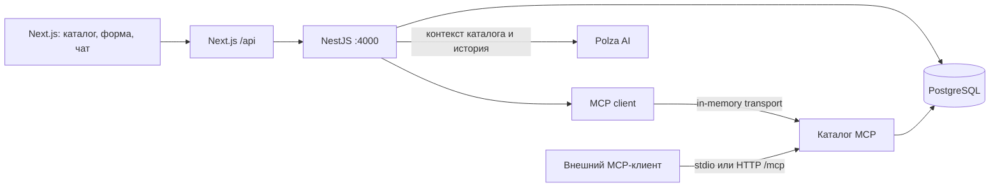

# Backend и консультант

## Что изменилось

Репозиторий содержал Next.js 16 / React 19, FSD-слои, лендинг, шесть статических услуг и демонстрационные адаптеры формы и чата. Серверного API и базы данных не было. Основная страница теперь использует HTTP-адаптеры; `/ui-kit` сохраняет демонстрационные сценарии. Каталог демоданных общий для seed и UI kit: `backend/data/services.json`.

Добавлен отдельный npm workspace `@siriustech/backend`: NestJS 11, PostgreSQL 17, `pg`, Zod, официальный TypeScript MCP SDK. SQL-запросы параметризованы. Миграции применяются транзакционно с журналом версий и блокировкой; seed повторяемый и не перезаписывает уже существующие услуги.



## Быстрый запуск

Из корня репозитория, где находится `package.json`:

```sh
npm ci
```

Скопируйте `.env.example` в `.env.local`, а `backend/.env.example` в `backend/.env`, если этих локальных файлов ещё нет. Не перезаписывайте настроенные файлы. В PowerShell можно использовать `Copy-Item`. Если выполнение `npm.ps1` запрещено, используйте `npm.cmd` вместо `npm`.

Для ИИ-консультанта задайте в `backend/.env`:

```dotenv
CHAT_MODE=polza
POLZA_API_KEY=ваш_ключ
POLZA_MODEL=openai/gpt-4o-mini
```

Если Polza открывается в браузере через системный прокси, но Node.js получает `UND_ERR_CONNECT_TIMEOUT`, задайте `POLZA_PROXY_URL=http://127.0.0.1:10809` в `backend/.env` (адрес и порт вашего прокси) и перезапустите NestJS. Эта настройка действует только на Polza; база и локальное API не проксируются. Пустое значение означает прямое соединение. TLS-проверка сертификатов остаётся включённой.

Ключ читается только NestJS. Он не передаётся браузеру, не попадает в `NEXT_PUBLIC_*` и исключён из Git. Запросы отправляются на `https://polza.ai/api/v1/chat/completions`. Модель можно заменить через `POLZA_MODEL`. В режиме `CHAT_MODE=catalog` внешний API не вызывается: используется явно обозначенный справочный режим. Ошибка Polza возвращается как 503; скрытой подмены ответа на mock нет.

Обычный запуск всего приложения — одна команда:

```sh
npm run dev
```

Она проверяет PostgreSQL, при необходимости запускает локальную базу, собирает NestJS, применяет миграции и seed, ждёт готовности API и запускает Next.js. Уже работающие PostgreSQL и API используются повторно. При Ctrl+C останавливаются только процессы, созданные этой командой. Для нестандартного `DATABASE_URL` сервер базы нужно запустить самостоятельно. Данные и ключ Polza сохраняются между запусками.

Если фронтенд уже работает, восстановите базу и API командой `npm run dev:services`, затем обновите страницу. `npm run dev:web` запускает только фронтенд — например, для UI kit и браузерных тестов с моками.

Для раздельного запуска запустите PostgreSQL одним из способов:

```sh
docker compose up -d postgres
# Или без Docker, в отдельном терминале:
npm run db:local
```

Локальный вариант запускает PostgreSQL 17 на `127.0.0.1:5432`, сохраняет данные в `.local/postgres` и завершается по Ctrl+C. Это реальная PostgreSQL, а не эмулятор. Не запускайте оба варианта одновременно на одном порту. Для существующей БД укажите `DATABASE_URL`; кодировка должна быть UTF-8. Пароль в примере предназначен для локальной разработки.

```sh
npm run db:setup
npm run backend:start
# В другом терминале:
npm run dev:web
```

Сайт: http://localhost:3000. API: http://127.0.0.1:4000/api/health. После изменения TypeScript бэкенда выполните `npm run backend:build` и перезапустите сервер (либо `npm run backend:dev`: сборка и наблюдение за скомпилированными файлами).

## API

| Метод | Путь NestJS | Назначение |
| --- | --- | --- |
| GET | `/api/health` | Проверка соединения и наличия таблицы каталога |
| GET | `/api/services?q=CRM` | Каталог или поиск |
| GET | `/api/services/:id` | Описание, цена, сроки, состав работ и FAQ |
| POST | `/api/requests` | Сохранить заявку |
| POST | `/api/chat/sessions` | Создать диалог; возвращает непрозрачный `token` |
| GET | `/api/chat/messages` | Последние 50 пар сообщений своего диалога |
| POST | `/api/chat/messages` | Отправить сообщение |
| DELETE | `/api/chat/session` | Удалить диалог и все его сообщения |
| POST | `/mcp` | MCP Streamable HTTP |

Заявка: `{ name, company?, phone, email, serviceId, consent: true }`. Сервер валидирует поля, согласие и существование услуги. Данные сохраняются в `project_requests`; рассылка сотрудникам и административный интерфейс не добавлялись.

Сообщение: `{ id: UUID, text: string, serviceId?: string }`, заголовок `Authorization: Bearer <токен_диалога>`. Максимум 2000 символов. История берётся из PostgreSQL, а не из пользовательского запроса. Ключ диалога хранится в `sessionStorage` вкладки; сервер сохраняет только SHA-256 хеш. Это анонимный диалог, без аккаунтов и восстановления между устройствами. Передача токена даёт доступ к диалогу.

`id` сообщения — ключ идемпотентности. Повтор того же запроса вернёт сохранённый ответ. Подмена текста или темы при том же `id` даёт 409. Транзакционная блокировка сериализует сообщения одного диалога. Ошибка провайдера не сохраняет полусформированную пару сообщений. Окно контекста модели ограничено последними шестью парами сообщений. Тайм-аут Polza — 45 секунд.

Браузер обращается к разрешённым маршрутам Next.js `/api/*`. Прокси ограничивает тело запроса, проверяет Origin и не проксирует MCP. NestJS по умолчанию слушает loopback. Лимиты запросов хранятся в памяти процесса: 15 сообщений / минуту, 10 сессий / минуту, 5 заявок / минуту на IP. При текущем локальном прокси это общий IP Next.js; для многопользовательского развёртывания настройте доверенный reverse proxy и общее хранилище лимитов. Не включайте произвольный `trust proxy` для входящих клиентских заголовков.

## MCP

Инструменты не раскрывают заявки или историю диалогов и не изменяют данные:

- `list_services({ query? })` — каталог и поиск.
- `get_service({ serviceId })` — подробная информация и FAQ.
- `recommend_services({ task })` — до трёх подходящих услуг.
- Ресурс `siriustech://services` — весь каталог.
- Промпт `service_consultation({ task })` — сценарий консультации с использованием инструментов.

Чат сайта вызывает эти же MCP-инструменты через `InMemoryTransport`, а затем передаёт проверенный контекст Polza. Внешним клиентам доступны stdio и HTTP.

Для stdio выполните `npm run backend:build`. В конфигурации вашего MCP-клиента:

```json
{
  "mcpServers": {
    "siriustech": {
      "command": "node",
      "args": ["C:/absolute/path/to/siriustech/backend/dist/mcp/stdio.js"]
    }
  }
}
```

Замените путь на абсолютный путь к этому репозиторию. `.env` загружается относительно backend, независимо от рабочей папки клиента. Процесс выводит в stdout только сообщения протокола. При ручном запуске используйте `node backend/dist/mcp/stdio.js`; npm может печатать служебные строки, поэтому в конфигурации клиента указан непосредственно `node`.

HTTP: `http://127.0.0.1:4000/mcp`, транспорт Streamable HTTP, заголовок `Authorization: Bearer <MCP_API_TOKEN>`. Токен задаётся в `backend/.env`. Если он пустой, endpoint отключён (503). Режим stateless, POST; GET/DELETE возвращают 405. Пример JSON-RPC тела после инициализации: `{"jsonrpc":"2.0","id":2,"method":"tools/list","params":{}}`.

## Проверки

```sh
npm run typecheck
npm run lint
npm test
npm run test:backend
npm run build
npx playwright install chromium
npm run test:e2e -- tests/e2e/consultation.spec.ts tests/e2e/ui-kit.spec.ts
```

Тесты бэкенда сами поднимают изолированный PostgreSQL на свободном порту. Проверяют повторные миграции и seed, API, валидацию, сохранение и изоляцию диалогов, удаление, идемпотентность, реальный MCP handshake и обработку ошибок Polza. Провайдер в автоматических тестах подменяется; платных запросов они не делают. Тестовые кластеры остаются в игнорируемой папке `.local/test-postgres` для диагностики.

Браузерные тесты проверяют 12 карточек, выбор темы, повтор сообщения после 503, восстановление истории, заявку, удаление диалога и три размера экрана. Для уже установленного Chrome можно задать `PLAYWRIGHT_CHANNEL=chrome` (PowerShell: `$env:PLAYWRIGHT_CHANNEL='chrome'`).

Официальные источники: [MCP TypeScript SDK](https://ts.sdk.modelcontextprotocol.io/server), [формат API Polza](https://polza.ai/providers/openai), [NestJS](https://docs.nestjs.com/).
